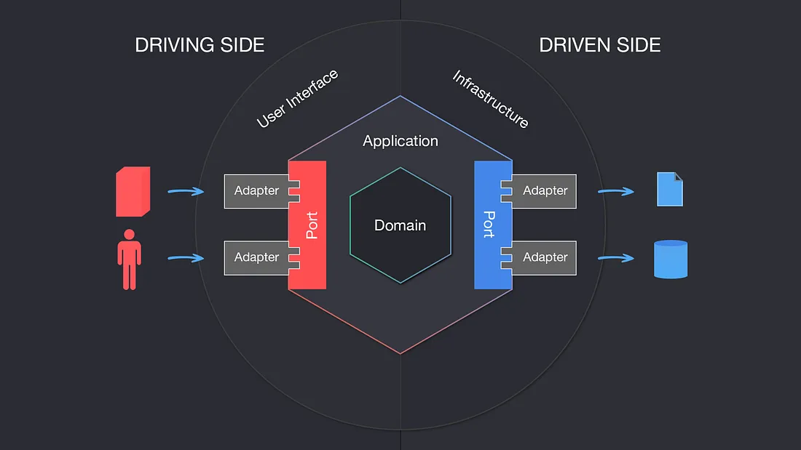

# Port And Adapter Architecture
## Overview
Port and adapter architecture or well-known as **Hexagonal Architecture** is firstly introduced by **Alistair Cockburn** in 2005. The main idea is  decoupling an application's core business logic from external systems (e.g., databases, UIs, APIs) by organizing code into ports (interfaces) and adapters (implementations). In Go, this is achieved using interfaces, dependency injection, and a clean separation of concerns.



## Key Components in Go

| Component           | Description                                                                 | Go Example                              |
|---------------------|-----------------------------------------------------------------------------|-----------------------------------------|
| **Core Domain**     | Business logic, entities, and rules (independent of external systems).      | Structs, methods in `internal/core` or `internal/domain`     |
| **Ports**           | Interfaces defining how the core interacts with the outside world.          | `UserRepository` interface              |
| **Primary Adapters**| Handle input (e.g., HTTP handlers, CLI commands).                           | HTTP handlers in `adapters/primary`     |
| **Secondary Adapters**| Handle output (e.g., databases, external APIs).                           | PostgreSQL implementation in `adapters/secondary` |

## Core Principles in Go
1. Decouple Logic from Infrastructure**
    - The core domain never directly depends on frameworks, databases, or UI.
    - External dependencies (e.g., PostgreSQL, HTTP servers) implement interfaces defined by the core.

2. **Ports (Interfaces)**
    - **Inbound Ports:** Define how external actors (e.g., users, APIs) interact with the core.
    - **Outbound Ports:** Define how the core interacts with external services (e.g., databases).

3. **Adapters (Implementations)**
    - **Primary Adapters:** Convert external input (e.g., HTTP requests) into core method calls.
    - **Secondary Adapters:** Implement outbound ports for specific technologies (e.g., PostgreSQL, Redis).

## Benefit in Go
- **Testability:** Mock adapters (e.g., in-memory databases) simplify unit testing.
- **Flexibility:** Swap databases, UIs, or APIs without changing core logic.
- **Clear Separation:** Business logic remains untouched by infrastructure changes.


## Project Structure

```plaintext
├── cmd/
│   ├── api/                 # HTTP Server Entry Point
│   ├── grpc/                # gRPC Server Entry Point
│   ├── consumer/            # Kafka Consumer Entry Point
│   ├── publisher/           # Kafka Publisher Entry Point
│   ├── migrate/             # Database Migration Runner
│   └── job/                 # Background Jobs
│
├── config/
│   ├── config.yaml          # Main Configuration File
│   ├── config.local.yaml    # Local Overrides
│   ├── config.dev.yaml      # Dev Environment Config
│   ├── config.prod.yaml     # Production Config
│
├── internal/
│   ├── domain/              # Business Models & Rules (Core)
│   │   ├── wallet.go        # Wallet Entity & Methods
│   │   ├── transaction.go   # Transaction Entity & Methods
│   │   ├── user.go          # User Entity
│   │
│   ├── usecase/             # Application Logic
│   │   ├── wallet_service.go  # Wallet Business Logic
│   │   ├── payment_service.go # Third-Party Payment Logic
│   │
│   ├── ports/               # Interfaces for Adapters
│   │   ├── wallet_repository.go  # DB Interface for Wallet
│   │   ├── payment_gateway.go    # Interface for Midtrans, Doku, Stripe
│   │   ├── event_publisher.go    # Kafka Producer Interface
│   │   ├── event_consumer.go     # Kafka Consumer Interface
│   │
│   ├── adapters/            # Implementations of Ports
│   │   ├── postgres_wallet_repo.go  # PostgreSQL Adapter
│   │   ├── redis_cache.go           # Redis Adapter
│   │   ├── mongo_transaction_repo.go # MongoDB Adapter
│   │   ├── kafka_publisher.go        # Kafka Producer
│   │   ├── kafka_consumer.go         # Kafka Consumer
│   │   ├── midtrans_gateway.go       # Midtrans Payment Adapter
│   │   ├── doku_gateway.go           # Doku Payment Adapter
│   │   ├── stripe_gateway.go         # Stripe Payment Adapter
│
├── migrations/
│   ├── 001_create_wallets.up.sql
│   ├── 001_create_wallets.down.sql
│   ├── 002_create_transactions.up.sql
│   ├── 002_create_transactions.down.sql
│
├── api/
│   ├── rest/
│   │   ├── handlers/
│   │   │   ├── wallet_handler.go     # Wallet HTTP Handlers
│   │   │   ├── transaction_handler.go # Transaction HTTP Handlers
│   │   ├── routes.go                 # REST API Router
│   ├── grpc/
│   │   ├── wallet_service.proto      # gRPC Definition
│   │   ├── transaction_service.proto # gRPC Definition
│
├── tests/
│   ├── wallet_test.go      # Unit Test for Wallet Logic
│   ├── transaction_test.go # Unit Test for Transactions
│
├── docker-compose.yml     # Services for PostgreSQL, Redis, Kafka, etc.
├── Makefile               # Useful Commands (build, test, run)
├── go.mod                 # Go Module Definition
└── main.go                # Main Application Entry Point
```

# ERD
```sql
Table users as U {
  id int [pk, increment, not null]
  fullname varchar [not null]
  email varchar [unique, not null]
  phone varchar [unique, not null]
  status varchar
  created_at datetime [not null, default: `now()`]
  updated_at datetime [not null, default: `now()`]
}

Table wallets as W {
  id int [pk, increment, not null]
  user_id int [Ref: - U.id, not null]
  balance int [not null, default: 0]
  currency_code varchar [not null]
  description varchar [null, note: 'optional notes']
  status varchar
  created_at datetime [not null, default: `now()`]
  updated_at datetime [not null, default: `now()`]
}

Table Transactions as T {
  id int [pk, increment, not null]
  wallet_id int [Ref: > W.id, not null]
  type varchar [not null, note: 'Transaction Type (deposit, withdrawal, transfer)']
  amount int [not null]
  status varchar [not null, note: 'pending, completed, failed']
  created_at datetime [not null, default: `now()`]
  updated_at datetime [not null, default: `now()`]
}

Table Payments as P {
  id int [pk, increment, not null]
  transaction_id int [Ref: - T.id, not null]
  gateway int [not null, note: 'Payment gateway (Midtrans, Doku, Stripe)']
  external_reference varchar [note: 'External reference ID']
  details json [null, note: 'extra info from gateway']
  status varchar
  created_at datetime [not null, default: `now()`]
  updated_at datetime [not null, default: `now()`]
}
```

## References
- [Netflix TechBlog: Ready for Changes with Hexagonal Architecture](https://netflixtechblog.com/ready-for-changes-with-hexagonal-architecture-b315ec967749)
- [Hexagonal Architecture: There are Always Two Sides to Every Story](https://medium.com/ssense-tech/hexagonal-architecture-there-are-always-two-sides-to-every-story-bc0780ed7d9c)
- [Why Clean Architecture Struggles in Golang and What Works Better](https://dev.to/lucasdeataides/why-clean-architecture-struggles-in-golang-and-what-works-better-m4g)
